# 📊 Fuzzy String Matching Process Flowcharts

## Main Process Flow

```mermaid
graph TD
    A[User Question:<br/>"Show me Alis's savings account"] --> B[LLM SQL Generation]
    B --> C[Generated SQL:<br/>WHERE full_name = 'alis']
    C --> D[String Literal Detection]
    D --> E[Extract Context:<br/>table=users, column=full_name]
    E --> F[Generate 8 Fuzzy Queries]
    F --> G[Execute Queries in Parallel]
    G --> H[Collect Results from Database]
    H --> I[Calculate Individual Scores]
    I --> J[Compute Composite Scores]
    J --> K[Select Best Match]
    K --> L[Replace in Original SQL]
    L --> M[Execute Corrected SQL]
    
    style A fill:#e1f5fe
    style M fill:#c8e6c9
    style F fill:#fff3e0
    style J fill:#fce4ec
```

## Detailed Scoring Process

```mermaid
graph LR
    A[Candidate: "Alison Smith"] --> B[Calculate Individual Scores]
    
    B --> C[Exact Match: 0.0]
    B --> D[SOUNDEX: 1.0]
    B --> E[Levenshtein: 0.67]
    B --> F[Trigram: 0.75]
    B --> G[Partial: 0.8]
    B --> H[Length: 0.67]
    
    C --> I[Apply Weights]
    D --> I
    E --> I
    F --> I
    G --> I
    H --> I
    
    I --> J[Composite Score: 0.565]
    J --> K{Score > 0.4?}
    K -->|Yes| L[Accept Match]
    K -->|No| M[Reject Match]
    
    style A fill:#e3f2fd
    style J fill:#fff3e0
    style L fill:#c8e6c9
    style M fill:#ffcdd2
```

## Algorithm Comparison Matrix

```mermaid
graph TD
    A[Input: "alis"] --> B[Multiple Algorithms]
    
    B --> C[SOUNDEX<br/>Phonetic Matching]
    B --> D[Levenshtein<br/>Edit Distance]
    B --> E[Trigram<br/>Character Sequences]
    B --> F[Pattern<br/>Substring Matching]
    
    C --> G["Alice: A420<br/>Alison: A425<br/>Allison: A425"]
    D --> H["Alice: distance=2<br/>Alison: distance=2<br/>Allison: distance=3"]
    E --> I["Alice: 0.4<br/>Alison: 0.8<br/>Allison: 0.6"]
    F --> J["Alice: No match<br/>Alison: 'alis' in 'alison'<br/>Allison: No match"]
    
    G --> K[Combine Results]
    H --> K
    I --> K
    J --> K
    
    K --> L[Final Ranking:<br/>1. Alison (0.85)<br/>2. Allison (0.72)<br/>3. Alice (0.65)]
    
    style A fill:#e1f5fe
    style L fill:#c8e6c9
```

## Parallel Query Execution

```mermaid
graph TD
    A[String Literal: "alis"] --> B[Query Generator]
    
    B --> C[Query 1: Pattern Match]
    B --> D[Query 2: SOUNDEX]
    B --> E[Query 3: Levenshtein ≤1]
    B --> F[Query 4: Levenshtein ≤2]
    B --> G[Query 5: Trigram Similarity]
    B --> H[Query 6: Word Similarity]
    
    C --> I[ThreadPool Executor]
    D --> I
    E --> I
    F --> I
    G --> I
    H --> I
    
    I --> J[Database Connection Pool]
    J --> K[PostgreSQL Database]
    
    K --> L[Results Collection]
    L --> M[Merge & Score Results]
    
    style A fill:#e3f2fd
    style I fill:#fff3e0
    style K fill:#f3e5f5
    style M fill:#c8e6c9
```

## Confidence Level Decision Tree

```mermaid
graph TD
    A[Composite Score Calculated] --> B{Score ≥ 0.8?}
    
    B -->|Yes| C[Very High Confidence<br/>Auto-Accept]
    B -->|No| D{Score ≥ 0.6?}
    
    D -->|Yes| E[High Confidence<br/>Accept with Notification]
    D -->|No| F{Score ≥ 0.4?}
    
    F -->|Yes| G[Medium Confidence<br/>Present Options]
    F -->|No| H{Score ≥ 0.2?}
    
    H -->|Yes| I[Low Confidence<br/>Suggest Alternatives]
    H -->|No| J[Very Low Confidence<br/>Reject Match]
    
    C --> K[Execute SQL with Match]
    E --> K
    G --> L[Show User Options]
    I --> L
    J --> M[Use Original Query or Ask User]
    
    style C fill:#c8e6c9
    style E fill:#dcedc8
    style G fill:#fff3e0
    style I fill:#ffe0b2
    style J fill:#ffcdd2
```



## Real-Time Processing Timeline


## Error Handling Flow


## Performance Optimization Strategy


## Configuration Tuning Matrix

