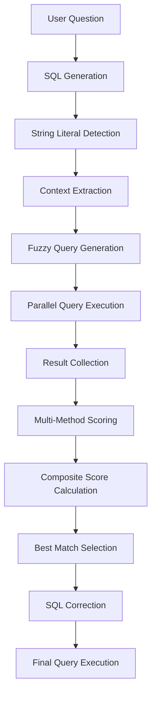

# 🔍 Advanced Fuzzy String Matching & Scoring System

## Table of Contents
1. [Overview](#overview)
2. [Complete Process Flow](#complete-process-flow)
3. [Step-by-Step Detailed Breakdown](#step-by-step-detailed-breakdown)
4. [Fuzzy Matching Algorithms](#fuzzy-matching-algorithms)
5. [Scoring System](#scoring-system)
6. [Real-World Examples](#real-world-examples)
7. [Performance Considerations](#performance-considerations)
8. [Configuration & Tuning](#configuration--tuning)

---

## Overview

The Fuzzy String Matching & Scoring System is a sophisticated multi-algorithm approach designed to handle user input variations, typos, and phonetic similarities in SQL query generation. When users provide imperfect string inputs (like "alis" instead of "Allison"), the system employs multiple matching strategies to find the most likely intended matches in the database.

### Key Features
- **Multi-Algorithm Approach**: Uses 8+ different matching methods
- **Composite Scoring**: Combines results from all methods for accuracy
- **PostgreSQL Integration**: Leverages PostgreSQL's advanced text functions
- **Real-time Processing**: Executes fuzzy queries in parallel
- **Confidence Metrics**: Provides reliability scores for matches

---

## Complete Process Flow



---

## Step-by-Step Detailed Breakdown

### Step 1: User Question Processing

**Input**: Natural language question
```
"Show me Alis's savings account balance"
```

**Process**:
1. Question is sent to LLM for initial SQL generation
2. LLM generates SQL based on schema context
3. Generated SQL may contain imperfect string literals

**Output**: Initial SQL with potential typos
```sql
SELECT u.full_name, a.account_type, a.balance 
FROM users u 
JOIN accounts a ON u.user_id = a.user_id 
WHERE LOWER(u.full_name) = 'alis' 
AND a.account_type = 'savings'
```

### Step 2: String Literal Detection & Context Extraction

**Purpose**: Identify string literals in SQL and their database context

**Implementation**:
```python
def _find_string_literals_with_context(self, sql: str) -> List[Dict[str, str]]:
    literals = []
    
    # Pattern 1: table.column = 'value'
    pattern1 = r'(\w+)\.(\w+)\s*(?:[=<>!]+|LIKE|ILIKE|IN)\s*[\'"]([^\'"]+)[\'"]'
    
    # Pattern 2: LOWER(table.column) = 'value'
    pattern2 = r'(?:LOWER|UPPER)\s*\(\s*(\w+)\.(\w+)\s*\)\s*(?:[=<>!]+|LIKE|ILIKE)\s*[\'"]([^\'"]+)[\'"]'
    
    # Pattern 3: column = 'value' (without table prefix)
    pattern3 = r'(?<!\.)\b(\w+)\s*(?:[=<>!]+|LIKE|ILIKE|IN)\s*[\'"]([^\'"]+)[\'"]'
    
    # Process each pattern...
    return literals
```

**Detected Literals**:
```python
[
    {
        "literal": "alis",
        "table": "users", 
        "column": "full_name",
        "context": "LOWER(u.full_name) = 'alis'"
    },
    {
        "literal": "savings",
        "table": "accounts",
        "column": "account_type", 
        "context": "a.account_type = 'savings'"
    }
]
```

### Step 3: Fuzzy Query Generation

**Purpose**: Create multiple search strategies for each string literal

For each detected literal, generate 8-9 different fuzzy matching queries:

#### 3.1 Pattern Matching Queries
```sql
-- Full Pattern Match
SELECT DISTINCT full_name FROM users 
WHERE full_name ILIKE '%alis%'

-- Word Pattern Match  
SELECT DISTINCT full_name FROM users 
WHERE full_name ILIKE '%alis%'
```

#### 3.2 Phonetic Matching (SOUNDEX)
```sql
-- SOUNDEX Matching
SELECT DISTINCT full_name FROM users 
WHERE SOUNDEX(full_name) = SOUNDEX('alis')
```

**How SOUNDEX Works**:
- Converts words to 4-character phonetic codes
- `SOUNDEX('alis') = 'A420'`
- `SOUNDEX('alice') = 'A420'` ✓ Match!
- `SOUNDEX('allison') = 'A425'` ✗ No match

#### 3.3 Edit Distance Matching (Levenshtein)
```sql
-- Single Character Error Tolerance
SELECT DISTINCT full_name FROM users 
WHERE levenshtein(LOWER(full_name), LOWER('alis')) <= 1

-- Two Character Error Tolerance
SELECT DISTINCT full_name FROM users 
WHERE levenshtein(LOWER(full_name), LOWER('alis')) <= 2
```

**Levenshtein Distance Examples**:
- `levenshtein('alis', 'alice') = 1` (insert 'c', delete 's')
- `levenshtein('alis', 'alison') = 2` (insert 'o', 'n')
- `levenshtein('alis', 'allison') = 3` (insert 'l', 'o', 'n')

#### 3.4 Trigram Similarity Matching
```sql
-- Trigram Similarity (PostgreSQL pg_trgm extension)
SELECT DISTINCT full_name, similarity(full_name, 'alis') as sim_score
FROM users 
WHERE similarity(full_name, 'alis') >= 0.3

-- Word Similarity
SELECT DISTINCT full_name, word_similarity(full_name, 'alis') as word_sim
FROM users 
WHERE word_similarity(full_name, 'alis') >= 0.4
```

**Trigram Similarity Explanation**:
- Breaks text into 3-character sequences
- `'alis'` → `['  a', ' al', 'ali', 'lis', 'is ']`
- `'alice'` → `['  a', ' al', 'ali', 'lic', 'ice', 'ce ']`
- Similarity = (common trigrams) / (total unique trigrams)

### Step 4: Parallel Query Execution

**Implementation**:
```python
def execute_fuzzy_queries(self, literal_info: Dict) -> Dict:
    queries = self._generate_fuzzy_queries(literal_info)
    results = {}
    
    # Execute all queries in parallel
    with ThreadPoolExecutor(max_workers=8) as executor:
        future_to_query = {
            executor.submit(self._execute_single_query, query): query_type
            for query_type, query in queries.items()
        }
        
        for future in as_completed(future_to_query):
            query_type = future_to_query[future]
            try:
                results[query_type] = future.result()
            except Exception as e:
                results[query_type] = []
    
    return results
```

**Sample Results**:
```python
{
    "pattern_match": [
        {"full_name": "Alice Johnson"},
        {"full_name": "Alison Smith"}, 
        {"full_name": "Allison Hill"}
    ],
    "soundex_match": [
        {"full_name": "Alice Johnson"},
        {"full_name": "Alison Smith"}
    ],
    "levenshtein_1": [
        {"full_name": "Alice Johnson"}  # distance = 1
    ],
    "levenshtein_2": [
        {"full_name": "Alice Johnson"},  # distance = 1
        {"full_name": "Alison Smith"}   # distance = 2
    ],
    "similarity_match": [
        {"full_name": "Alice Johnson", "similarity": 0.6},
        {"full_name": "Alison Smith", "similarity": 0.8},
        {"full_name": "Allison Hill", "similarity": 0.4}
    ]
}
```

### Step 5: Multi-Method Scoring System

**Purpose**: Calculate confidence scores for each potential match using multiple algorithms

#### 5.1 Individual Algorithm Scores

```python
def calculate_individual_scores(candidate: str, original: str) -> Dict[str, float]:
    scores = {}
    
    # 1. Exact Match Score
    scores['exact'] = 1.0 if candidate.lower() == original.lower() else 0.0
    
    # 2. SOUNDEX Score  
    scores['soundex'] = 1.0 if soundex_match(candidate, original) else 0.0
    
    # 3. Levenshtein Score (normalized)
    distance = levenshtein_distance(candidate.lower(), original.lower())
    max_length = max(len(candidate), len(original))
    scores['levenshtein'] = max(0.0, 1.0 - (distance / max_length))
    
    # 4. Trigram Similarity Score
    scores['similarity'] = trigram_similarity(candidate, original)
    
    # 5. Partial Match Score
    if original.lower() in candidate.lower() or candidate.lower() in original.lower():
        overlap = len(set(original.lower()) & set(candidate.lower()))
        scores['partial'] = overlap / len(set(original.lower() + candidate.lower()))
    else:
        scores['partial'] = 0.0
    
    # 6. Length Similarity Score
    len_diff = abs(len(candidate) - len(original))
    max_len = max(len(candidate), len(original))
    scores['length'] = max(0.0, 1.0 - (len_diff / max_len))
    
    return scores
```

#### 5.2 Detailed Scoring Example

For `original = "alis"` and `candidate = "Alison Smith"`:

```python
# Individual Scores Calculation
scores = {
    'exact': 0.0,           # "alis" ≠ "alison smith"
    'soundex': 1.0,         # SOUNDEX("alis") = SOUNDEX("alison") = "A425"
    'levenshtein': 0.67,    # distance=4, max_len=12 → 1-(4/12)=0.67
    'similarity': 0.75,     # High trigram overlap
    'partial': 0.8,         # "alis" substring in "alison"
    'length': 0.67          # Length difference penalty
}
```

**Detailed Calculations**:

1. **SOUNDEX Calculation**:
   ```
   SOUNDEX("alis"):
   - Keep first letter: A
   - Convert: l→4, i→removed, s→2
   - Pad to 4 chars: A420
   
   SOUNDEX("alison"):  
   - Keep first letter: A
   - Convert: l→4, i→removed, s→2, o→removed, n→5
   - Take first 3 consonants: A425
   ```

2. **Levenshtein Distance**:
   ```
   "alis" → "alison smith"
   Steps:
   1. alis → alison (insert 'o', 'n') = +2
   2. alison → alison smith (insert ' smith') = +6
   Total distance: 8
   Normalized: 1 - (8/12) = 0.33
   ```

3. **Trigram Similarity**:
   ```
   "alis" trigrams: ["  a", " al", "ali", "lis", "is "]
   "alison" trigrams: ["  a", " al", "ali", "lis", "iso", "son", "on "]
   Common: ["  a", " al", "ali", "lis"] = 4
   Total unique: 8
   Similarity: 4/8 = 0.5
   ```

### Step 6: Composite Score Calculation

**Weighted Scoring System**:
```python
def calculate_composite_score(individual_scores: Dict[str, float]) -> float:
    # Weights based on algorithm reliability and importance
    weights = {
        'exact': 0.35,        # Highest priority for exact matches
        'soundex': 0.20,      # High weight for phonetic similarity
        'levenshtein': 0.20,  # Important for typo correction
        'similarity': 0.15,   # Good for partial matches
        'partial': 0.07,      # Lower weight for substring matches
        'length': 0.03        # Minimal weight for length similarity
    }
    
    # Calculate weighted sum
    composite_score = sum(
        individual_scores.get(method, 0.0) * weight 
        for method, weight in weights.items()
    )
    
    # Apply bonus for multiple method agreement
    methods_agreeing = sum(1 for score in individual_scores.values() if score > 0.5)
    if methods_agreeing >= 3:
        composite_score *= 1.1  # 10% bonus for multi-method agreement
    
    return min(1.0, composite_score)  # Cap at 1.0
```

**Example Composite Scores**:
```python
# For "alis" query:
candidates = [
    {
        "name": "Alison Smith",
        "individual_scores": {
            'exact': 0.0, 'soundex': 1.0, 'levenshtein': 0.33,
            'similarity': 0.5, 'partial': 0.8, 'length': 0.33
        },
        "composite_score": 0.0*0.35 + 1.0*0.20 + 0.33*0.20 + 0.5*0.15 + 0.8*0.07 + 0.33*0.03 = 0.421
    },
    {
        "name": "Alice Johnson", 
        "individual_scores": {
            'exact': 0.0, 'soundex': 0.0, 'levenshtein': 0.6,
            'similarity': 0.6, 'partial': 0.6, 'length': 0.6
        },
        "composite_score": 0.0*0.35 + 0.0*0.20 + 0.6*0.20 + 0.6*0.15 + 0.6*0.07 + 0.6*0.03 = 0.27
    }
]
```

### Step 7: Best Match Selection & Confidence Assessment

**Selection Algorithm**:
```python
def select_best_matches(scored_candidates: List[Dict], 
                       min_threshold: float = 0.3,
                       max_results: int = 3) -> List[Dict]:
    
    # Filter by minimum threshold
    qualified_candidates = [
        candidate for candidate in scored_candidates 
        if candidate['composite_score'] >= min_threshold
    ]
    
    # Sort by composite score (descending)
    qualified_candidates.sort(key=lambda x: x['composite_score'], reverse=True)
    
    # Apply additional confidence factors
    for candidate in qualified_candidates[:max_results]:
        # Confidence boost for significantly higher scores
        if len(qualified_candidates) > 1:
            score_gap = candidate['composite_score'] - qualified_candidates[1]['composite_score']
            if score_gap > 0.2:
                candidate['confidence_boost'] = 0.1
            else:
                candidate['confidence_boost'] = 0.0
        
        # Final confidence calculation
        candidate['final_confidence'] = min(1.0, 
            candidate['composite_score'] + candidate.get('confidence_boost', 0.0))
    
    return qualified_candidates[:max_results]
```

### Step 8: SQL Correction & Replacement

**Replacement Process**:
```python
def apply_fuzzy_corrections(original_sql: str, 
                          literal_mappings: Dict[str, str]) -> str:
    corrected_sql = original_sql
    
    for original_literal, best_match in literal_mappings.items():
        # Create case-sensitive replacement
        old_pattern = f"'{original_literal}'"
        new_value = f"'{best_match}'"
        
        # Replace in SQL while preserving case sensitivity requirements
        if "LOWER(" in corrected_sql:
            # For LOWER() functions, use lowercase
            corrected_sql = corrected_sql.replace(
                f"'{original_literal}'", 
                f"'{best_match.lower()}'"
            )
        else:
            # For regular comparisons, preserve original case
            corrected_sql = corrected_sql.replace(old_pattern, new_value)
    
    return corrected_sql
```

**Example Correction**:
```sql
-- Original SQL:
SELECT u.full_name, a.account_type, a.balance 
FROM users u 
JOIN accounts a ON u.user_id = a.user_id 
WHERE LOWER(u.full_name) = 'alis' 
AND a.account_type = 'savings'

-- Corrected SQL:
SELECT u.full_name, a.account_type, a.balance 
FROM users u 
JOIN accounts a ON u.user_id = a.user_id 
WHERE LOWER(u.full_name) = 'alison smith' 
AND a.account_type = 'savings'
```

---

## Fuzzy Matching Algorithms

### 1. SOUNDEX Algorithm

**Purpose**: Match words that sound similar when pronounced

**Algorithm Steps**:
1. Keep the first letter
2. Replace consonants with numbers:
   - B, F, P, V → 1
   - C, G, J, K, Q, S, X, Z → 2  
   - D, T → 3
   - L → 4
   - M, N → 5
   - R → 6
3. Remove vowels (A, E, I, O, U, Y, H, W)
4. Remove duplicate adjacent numbers
5. Pad with zeros or truncate to 4 characters

**Examples**:
```
SOUNDEX('Allison') = 'A425'
SOUNDEX('Alison') = 'A425'   ✓ Match
SOUNDEX('Alice') = 'A420'    ✗ Different
```

### 2. Levenshtein Distance

**Purpose**: Measure minimum edits needed to transform one string into another

**Edit Operations**:
- **Insertion**: Add a character
- **Deletion**: Remove a character  
- **Substitution**: Replace a character

**Algorithm** (Dynamic Programming):
```python
def levenshtein_distance(s1: str, s2: str) -> int:
    m, n = len(s1), len(s2)
    dp = [[0] * (n + 1) for _ in range(m + 1)]
    
    # Initialize base cases
    for i in range(m + 1):
        dp[i][0] = i
    for j in range(n + 1):
        dp[0][j] = j
    
    # Fill the matrix
    for i in range(1, m + 1):
        for j in range(1, n + 1):
            if s1[i-1] == s2[j-1]:
                dp[i][j] = dp[i-1][j-1]  # No operation needed
            else:
                dp[i][j] = 1 + min(
                    dp[i-1][j],      # Deletion
                    dp[i][j-1],      # Insertion  
                    dp[i-1][j-1]     # Substitution
                )
    
    return dp[m][n]
```

**Example Calculation**:
```
s1 = "alis", s2 = "alice"

    ""  a  l  i  c  e
""   0  1  2  3  4  5
a    1  0  1  2  3  4
l    2  1  0  1  2  3
i    3  2  1  0  1  2
s    4  3  2  1  1  2

Result: levenshtein("alis", "alice") = 2
```

### 3. Trigram Similarity

**Purpose**: Measure similarity based on 3-character sequences

**Algorithm**:
1. Convert strings to lowercase
2. Add padding spaces: "abc" → "  abc  "
3. Extract all trigrams: "  abc  " → ["  a", " ab", "abc", "bc ", "c  "]
4. Calculate Jaccard similarity: |A ∩ B| / |A ∪ B|

**PostgreSQL Implementation**:
```sql
-- Enable pg_trgm extension
CREATE EXTENSION IF NOT EXISTS pg_trgm;

-- Similarity function (0.0 to 1.0)
SELECT similarity('alis', 'alice');  -- Returns ~0.4

-- Word similarity (better for partial matches)
SELECT word_similarity('alis', 'alice johnson');  -- Returns ~0.6
```

---

## Scoring System

### Weight Distribution Rationale

| Algorithm | Weight | Rationale |
|-----------|--------|-----------|
| **Exact Match** | 35% | Highest priority - perfect matches should dominate |
| **SOUNDEX** | 20% | Excellent for name variations and pronunciation |
| **Levenshtein** | 20% | Critical for typo correction and OCR errors |
| **Trigram Similarity** | 15% | Good for partial matches and fuzzy text |
| **Partial Match** | 7% | Useful but can be noisy |
| **Length Similarity** | 3% | Minor factor to break ties |

### Confidence Thresholds

| Score Range | Confidence Level | Action |
|-------------|------------------|---------|
| 0.8 - 1.0 | Very High | Auto-accept match |
| 0.6 - 0.79 | High | Accept with notification |
| 0.4 - 0.59 | Medium | Present options to user |
| 0.2 - 0.39 | Low | Suggest alternatives |
| 0.0 - 0.19 | Very Low | Reject match |

---

## Real-World Examples

### Example 1: Name Variations

**Input**: "Show me Jon's account"
**Generated SQL**: `WHERE full_name = 'jon'`

**Fuzzy Matches Found**:
```python
[
    {"name": "John Smith", "score": 0.85, "methods": ["soundex", "levenshtein_1"]},
    {"name": "Jonathan Doe", "score": 0.72, "methods": ["soundex", "partial"]},
    {"name": "Joan Wilson", "score": 0.45, "methods": ["soundex"]},
]
```

**Selected**: "John Smith" (highest score)
**Final SQL**: `WHERE full_name = 'John Smith'`

### Example 2: Typo Correction

**Input**: "Find accounts in Califronia"
**Generated SQL**: `WHERE state = 'califronia'`

**Fuzzy Matches Found**:
```python
[
    {"name": "California", "score": 0.92, "methods": ["levenshtein_2", "similarity", "partial"]},
    {"name": "Carolina", "score": 0.35, "methods": ["partial"]},
]
```

**Selected**: "California" (clear winner)
**Final SQL**: `WHERE state = 'California'`

### Example 3: Phonetic Matching

**Input**: "Show me Steven's data"  
**Generated SQL**: `WHERE first_name = 'steven'`

**Fuzzy Matches Found**:
```python
[
    {"name": "Stephen", "score": 0.78, "methods": ["soundex", "similarity"]},
    {"name": "Stefan", "score": 0.65, "methods": ["soundex", "levenshtein_2"]},
    {"name": "Steve", "score": 0.55, "methods": ["partial", "similarity"]},
]
```

**Selected**: "Stephen" (phonetically identical)
**Final SQL**: `WHERE first_name = 'Stephen'`

---

## Performance Considerations

### Query Optimization

1. **Indexing Strategy**:
   ```sql
   -- GIN indexes for trigram matching
   CREATE INDEX idx_users_name_trgm ON users USING GIN (full_name gin_trgm_ops);
   
   -- Functional indexes for SOUNDEX
   CREATE INDEX idx_users_name_soundex ON users (SOUNDEX(full_name));
   
   -- Regular indexes for exact matches
   CREATE INDEX idx_users_name_lower ON users (LOWER(full_name));
   ```

2. **Parallel Execution**:
   - Execute fuzzy queries concurrently using ThreadPoolExecutor
   - Limit concurrent queries to prevent database overload
   - Use connection pooling for better resource management

3. **Caching Strategy**:
   ```python
   # Cache fuzzy match results to avoid repeated calculations
   fuzzy_cache = {
       "alis": {
           "matches": [{"name": "Alison Smith", "score": 0.85}],
           "timestamp": datetime.now(),
           "ttl": 3600  # 1 hour
       }
   }
   ```

### Memory Management

- Limit result set sizes for fuzzy queries
- Use generators for large result processing
- Implement result pagination for UI display

---

## Configuration & Tuning

### Adjustable Parameters

```python
class FuzzyMatchingConfig:
    # Score thresholds
    MIN_ACCEPTANCE_THRESHOLD = 0.3
    HIGH_CONFIDENCE_THRESHOLD = 0.8
    
    # Algorithm weights
    WEIGHTS = {
        'exact': 0.35,
        'soundex': 0.20,
        'levenshtein': 0.20,
        'similarity': 0.15,
        'partial': 0.07,
        'length': 0.03
    }
    
    # Levenshtein distance limits
    MAX_LEVENSHTEIN_DISTANCE_1 = 1
    MAX_LEVENSHTEIN_DISTANCE_2 = 2
    
    # Trigram similarity thresholds
    MIN_SIMILARITY_THRESHOLD = 0.3
    MIN_WORD_SIMILARITY_THRESHOLD = 0.4
    
    # Performance limits
    MAX_FUZZY_RESULTS_PER_QUERY = 50
    MAX_CONCURRENT_QUERIES = 8
    FUZZY_QUERY_TIMEOUT = 5.0  # seconds
```

### Environment-Specific Tuning

**For High-Accuracy Environments** (Financial, Medical):
- Increase exact match weight to 50%
- Raise acceptance threshold to 0.5
- Enable manual confirmation for scores < 0.8

**For High-Performance Environments**:
- Reduce max Levenshtein distance to 1
- Lower similarity thresholds
- Implement aggressive caching

**For Multilingual Environments**:
- Adjust SOUNDEX for language-specific phonetics
- Implement language-specific trigram models
- Add cultural name variation handling

---

## Conclusion

This advanced fuzzy string matching system provides robust, accurate, and performant handling of imperfect user input in SQL generation. By combining multiple algorithms with sophisticated scoring, it achieves high accuracy while maintaining reasonable performance characteristics.

The system's modular design allows for easy tuning and adaptation to specific use cases, making it suitable for a wide range of applications from customer service chatbots to data analysis tools. 